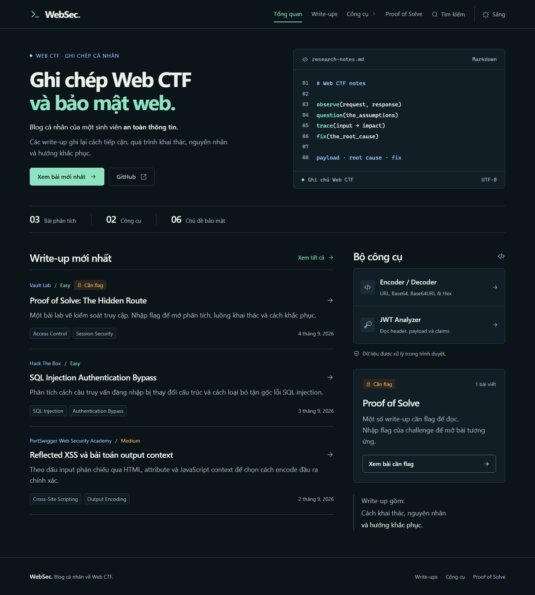

# WebSec Write-up Vault

Website chia sẻ write-up CTF, kèm Encoder/Decoder và JWT Analyzer. Xây dựng bằng Next.js, React và TypeScript.



## Chạy local

Yêu cầu Node.js 22 hoặc 24.

```sh
npm ci
npm run dev
```

Mở <http://localhost:3000>.

## Cấu trúc

| Thư mục | Nội dung |
| --- | --- |
| `app/` | Trang và API |
| `components/` | Thành phần giao diện |
| `lib/` | Xử lý nội dung, công cụ và xác thực |
| `content/public/` | Bài viết Markdown có front matter |
| `content/locked/` | Bài khóa: `metadata.json` và `writeup.md` |
| `public/` | Tài nguyên tĩnh |
| `scripts/` | CLI nhập bài và kiểm tra nội dung |
| `tests/` | Unit và E2E tests |

Bài có `draft: true` được ẩn. Danh sách xếp theo `publishedAt` giảm dần, cùng ngày theo `sortOrder` tăng dần. Heading `##` và `###` tạo mục lục tự động.

## Kiểm tra

```sh
npm run check
npx playwright install chromium
npm run test:e2e
```

`npm run check` kiểm tra nội dung, lint, kiểu dữ liệu, unit tests và build production. Cấu hình tự động nằm trong [workflow CI](.github/workflows/ci.yml).

Giới hạn bảo vệ bài khóa và cấu hình bảo mật: [THREAT_MODEL.md](THREAT_MODEL.md). Không commit `.env.local` hoặc secret.
